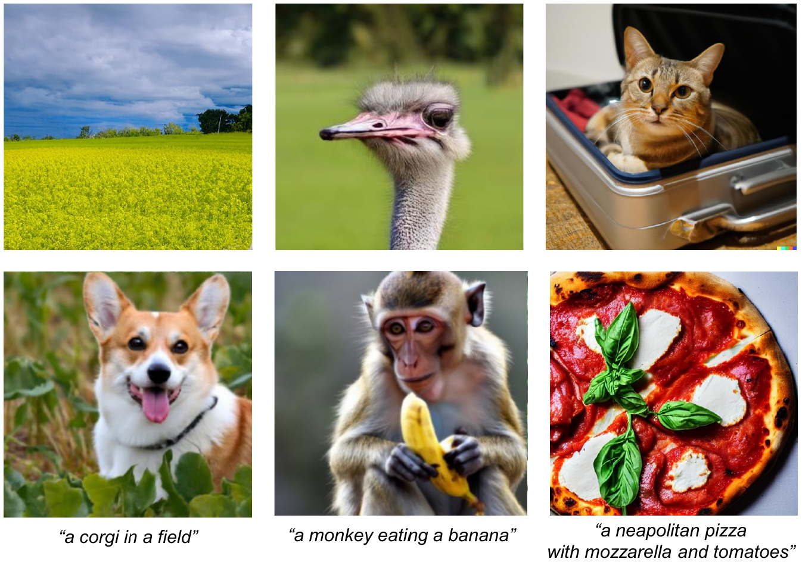

# On the detection of synthetic images generated by diffusion models

[](https://grip-unina.github.io/DMimageDetection/)
[](https://arxiv.org/abs/2211.00680)
[](https://doi.org/10.1109/ICASSP49357.2023.10095167)
[](https://www.grip.unina.it)

<p align="center">
 
</p>

This is the official repository of the paper:
[On the detection of synthetic images generated by diffusion models](https://arxiv.org/abs/2211.00680).
Riccardo Corvi, Davide Cozzolino, Giada Zingarini, Giovanni Poggi, Koki Nagano, Luisa Verdoliva

## Test-set
The synthetic images used as test can be downloaded from the following [link](https://drive.google.com/file/d/1grvgKiIq0ny8ImQzSUXPk3nd-AMEDjNb/view?usp=share_link) alongside a csv file stating the processing applied in the paper on each image. The real images can be downloaded from the following freely available datasets : [IMAGENET](https://image-net.org/index.php), [UCID](https://www.spiedigitallibrary.org/conference-proceedings-of-spie/5307/0000/UCID-an-uncompressed-color-image-database/10.1117/12.525375.short),[COCO - Common Objects in Context](https://cocodataset.org/#home).
The real images should then be placed in a folder with the same name that has been recorded in the csv file
The directory containing the test set should have the following structure:
```
Testset directory
|--biggan_256
|--biggan_512
.
.
.
|--real_coco_valid
|--real_imagenet_valid
|--real_ucid
.
.
.
|--taming-transformers_segm2image_valid
```

The annotations used to generate images with text to images models belong to the COCO Consortium and are licensed under a Creative Commons Attribution 4.0 License (https://cocodataset.org/#termsofuse).

If you plan to use the dataset, please cite our paper ["On the detection of synthetic images generated by diffusion models"](https://doi.org/10.1109/ICASSP49357.2023.10095167).

## Traning-set

#### 1) ProGAN Traning-set
For training using ProGAN images, we used the traning-set provided by ["CNN-generated images are surprisingly easy to spot...for now"](https://github.com/PeterWang512/CNNDetection)
 
#### 2) Latent Diffusion Traning-set
For training using Latent Diffusion images, we generated 200K fake images, while the 200K real images come from two public datasets, [COCO - Common Objects in Context](https://cocodataset.org/#home) and  [LSUN - Large-scale Scene Understanding](https://www.yf.io/p/lsun).
The fake images and the lists of used real images can be downloaded [here](https://www.grip.unina.it/download/prog/DMimageDetection/latent_diffusion_trainingset.zip).
If you plan to use the dataset, please cite our paper ["On the detection of synthetic images generated by diffusion models"](https://doi.org/10.1109/ICASSP49357.2023.10095167).


## Code

[](https://github.com/grip-unina/DMimageDetection/tree/main/test_code)
[](https://github.com/grip-unina/DMimageDetection/tree/main/training_code)

## Overview

Over the past decade, there has been tremendous progress in creating synthetic media, mainly thanks to the development of powerful methods based on generative adversarial networks (GAN). Very recently, methods based on diffusion models (DM) have been gaining the spotlight. In addition to providing an impressive level of photorealism, they enable the creation of text-based visual content, opening up new and exciting opportunities in many different application fields, from arts to video games. On the other hand, this property is an additional asset in the hands of malicious users, who can generate and distribute fake media perfectly adapted to their attacks, posing new challenges to the media forensic community. With this work, we seek to understand how difficult it is to distinguish synthetic images generated by diffusion models from pristine ones and whether current state-of-the-art detectors are suitable for the task. To this end, first we expose the forensics traces left by diffusion models, then study how current detectors, developed for GAN-generated images, perform on these new synthetic images, especially in challenging social-network scenarios involving image compression and resizing.

## License

Copyright 2024 Image Processing Research Group of University Federico
II of Naples ('GRIP-UNINA'). All rights reserved.
                        
Licensed under the Apache License, Version 2.0 (the "License");       
you may not use this file except in compliance with the License. 
You may obtain a copy of the License at                    
                                           
    http://www.apache.org/licenses/LICENSE-2.0
                                                      
Unless required by applicable law or agreed to in writing, software
distributed under the License is distributed on an "AS IS" BASIS,    
WITHOUT WARRANTIES OR CONDITIONS OF ANY KIND, either express or implied.                         
See the License for the specific language governing permissions and
limitations under the License.

## Bibtex 

```
@InProceedings{Corvi_2023_ICASSP,
  author={Corvi, Riccardo and Cozzolino, Davide and Zingarini, Giada and Poggi, Giovanni and Nagano, Koki and Verdoliva, Luisa},
  title={On The Detection of Synthetic Images Generated by Diffusion Models},
  booktitle={IEEE International Conference on Acoustics, Speech and Signal Processing (ICASSP)}, 
  year={2023},
  pages={1-5},
  doi={10.1109/ICASSP49357.2023.10095167}
}
```


